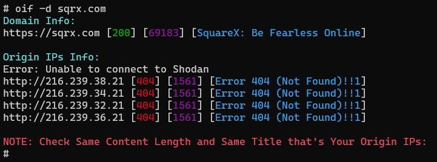

# Origin-IP-Finder

- **Available Search engine support**
  - **[dig](https://phoenixnap.com/kb/linux-dig-command-examples)**
  - **[shodan](https://www.shodan.io)**
  - **[censys](https://search.censys.io)**
  - **[securitytrails](https://securitytrails.com)**
  - **[viewdns](https://viewdns.info)**
  - **[hunter-how](https://hunter.how)**
  - **[fofa](https://en.fofa.info)**
  - **[zoomeye](https://www.zoomeye.org)**
  - **[zoomeye_without_api](https://www.zoomeye.org)**
  
# Installation
```
git clone https://github.com/rix4uni/Origin-IP-Finder.git
cd Origin-IP-Finder
chmod +x oif
mv oif /usr/bin/
```

# Setup

**shodan api is `paid` and setup is `optional` but if want good results please setup...**

```
shodan init SHODAN_API_KEY
```
  
# Usage
  
```
oif -d domain.com
```

```
bash oif -d domain.com -censys censys-api-id:censys-api-secrect -securitytrails api -hunter api -zoomeye api
```

# Output

